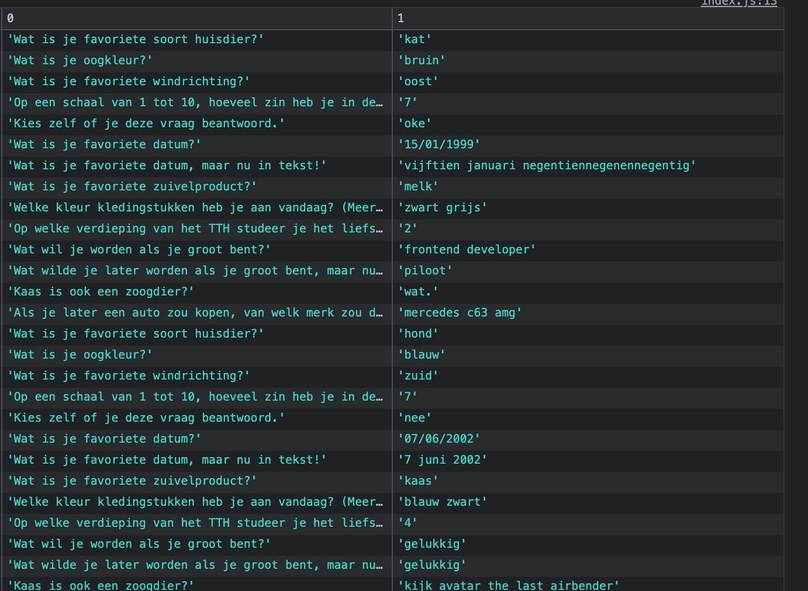
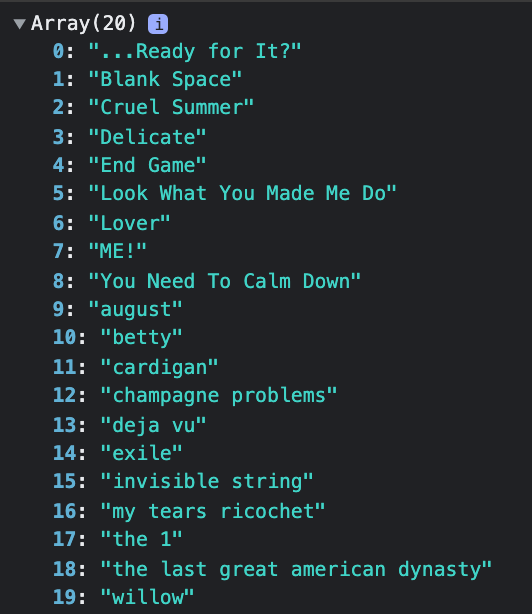

# Functional Programming

## Concept
In dit project maak ik de data van een enquête schoon en laat ik data vanuit een API zien.
Alle informatie en de verloop van het project kan je in mijn <a href="https://github.com/marloestacx/functional-programming/wiki/concept">wiki</a> lezen.

## Enquête opschonen


## API data


## Installeren
Clone deze repository

```
git clone https://github.com/marloestacx/functional-programming.git
```

## License
<a href="https://github.com/marloestacx/functional-programming/blob/main/LICENSE"> MIT license </a>


